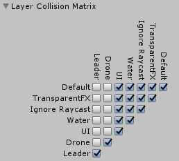
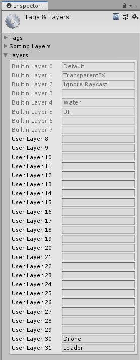

# Swarmify
Swarmify is a simple swarm motion planning and collision avoidance simulation based on the potential field method.

## How it works
Without going into detail. Every agent (Follower) has its own sensor range. Within that, it reacts to other agents by moving away from them. Also, every agent has a target (Leader) which it tries to reach.
In other words. The movement directions results of the sum of all repulsive parts (other agents) and the attractive part (target).
Properly set up and tweaked this leads to pretty fluent and also collision-free motion/path planning.

... The terms Leader, Attractor, and Target as well as Agent, Drone, and Follower are used synonymously.

## Basic set up guide

### One Leader and one Autonomous drone
1. Import Package
2. Set Layers (30: Droen, 31: Leader) and set Layer Collision Matrix (Drone only by Drone and Leader only by Leader). See images 
    * Now you can start playing around with the test scenes right away.
    * Add scenes to build settings to enable scene switch buttons (Autonomous, AutonomousDirected, and Centralized). See images "01_AddLayerNames.JPG" and "02_SetMap.JPG"
3. To integrate in you scenes: add **AutonomousDrone** to you scene
4. Add **Leader** to you scene
5. Set **Attractor** of **AutonomousDrone** by dragging **Leader GameObject** in Inspector
6. Hit Play
* Works the same with **AutonomousDroneDirected**
    * only that **AutonomousDroneDirected** rotates its model torwards the **Leader**.

### One Leader and multiple Autonomous drones
Just add more **Drones** and assign the same **Leader**

### Centralized setup
Same as the Autonomous setup. In addition, add a **CentralizedProcessor** to you scene.
Don't forget to assign the **Leader**/**Attractor** of the **Drone**. As the centralized implementation checks every agent against every agent in each tick, its performance extremely decreases by increasing the number of agents. The autonomous implementation is more efficient.

## Layer/Physics setup

